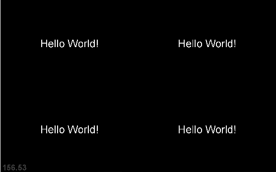

Tutorial: Using Runtime.py
====================

As mentioned, each app, as well as most of the scripts of the Unlock Repository,
is located within folders for better organization. Runtime.py is the exception.
It sits outside of the lower folders in the top folder.
This is the only script you should ever have to run.
This is the script that collects your data, processes the recordings, and displays your apps.
Of course, it does not do all these things by itself;
it calls other scripts to do the work for it.
This program is also good as a test bench for your applications because it will set up
the whole structure of the program, every time you run.
Let’s look at a basic version of the script for running an app:

>>> from core import Screen
... from apps import HelloWorld
...
... def get_apps(window):
...
...     full = Screen(0,0,window.width, window.height)
...
...     app1 = HelloWorld(full)
...
...     return [app1]
...
... if __name__ == '__main__':
...     from core import viewport
...     viewport.controller.apps = get_apps(viewport.window)
...     viewport.start()

It starts out by importing Screen.

>>> from core import Screen
...

As I mentioned, this is a script that will be discussed in a future tutorial.
In the meantime think of it as a script that defines the conditions
of the computer screen that you are using.

It also imports an app from the apps folder

>>> from core import Screen
... from apps import HelloWorld

Apps refers to the repository folder that contains BCI apps.
In this case we are importing HelloWorld.
HelloWorld is the name of the class of the app.

.. warning:: Capitalization is important.

Next comes the method get_apps.

>>> from core import Screen
... from apps import HelloWorld
...
... def get_apps(window):

This method is given the window size as a variable,
and it returns the apps that we want to display on the screen.
To do this we will set a portion of the screen named full.

>>> from core import Screen
... from apps import HelloWorld
...
... def get_apps(window):
...
...     full = Screen(0,0,window.width, window.height)

Notice how we used the Screen class to create the screen partition.

Now that we have the screen size set up, we can send it to our app.
We only have one app. So we write it like this:

>>> from core import Screen
... from apps import HelloWorld
...
... def get_apps(window):
...
...     full = Screen(0,0,window.width, window.height)
...
...     app1 = HelloWorld(full)

And then this after it:

>>> from core import Screen
... from apps import HelloWorld
...
... def get_apps(window):
...
...     full = Screen(0,0,window.width, window.height)
...
...     app1 = HelloWorld(full)
...
...     return [app1]

Using the return function allows the names of the apps to be given to the method.

Now the get_apps method is just that; only a method. We need a command to run get_apps
This command will be placed at the bottom of the script

>>> from core import Screen
... from apps import HelloWorld
...
... def get_apps(window):
...
...     full = Screen(0,0,window.width, window.height)
...
...     app1 = HelloWorld(full)
...
...     return [app1]
...
... if __name__ == '__main__':
...     from core import viewport
...     viewport.controller.apps = get_apps(viewport.window)
...     viewport.start()

You will notice we are now importing a new module names viewport.
For the most part you won’t need to know what viewport does.
It and another module named controller handle the underworkings of the app process.
In fact you should not need to touch this portion ever.
The only important thing you need to know about viewport is that ir requires the
Pyglet Graphics Library. If you do not already have it, you should download Pyglet,
and install it.
It also here where viewport.start is run to start the program.

This is what the runtime.py script looks like all together,
and when all said and done, it should look like this.

.. figure:: images/HelloWorld.png
   :align: center

Let’s say though, that you don’t just want one app, but four apps running at the same time.
We would need to partition the screen differently. We would also need to add new apps to run.
To do this, we would change the script like this:

>>> from core import Screen
... from apps import HelloWorld
...
... def get_apps(window):
...
...     w2 = window.width / 2
...     h2 = window.height / 2
...     full = Screen(0,0,window.width, window.height)
...     bottom_left = Screen(0, 0, w2, h2)
...     bottom_right = Screen(w2, 0, w2, h2)
...     top_left = Screen(0, h2, w2, h2)
...     top_right = Screen(w2, h2, w2, h2)
...
...
...     app1 = HelloWorld(bottom_left)
...
...     app2 = HelloWorld(bottom_right)
...
...     app3 = HelloWorld(top_left)
...
...     app4 = HelloWorld(top_right)
...
...     return [app1, app2, app3, app4]
...
... if __name__ == '__main__':
...     from core import viewport
...     viewport.controller.apps = get_apps(viewport.window)
...     viewport.start()

Which would create this:

Now there is one more step for making this app appear. It is a quick fix, but an important one. It deals with a file called __init__.py.
